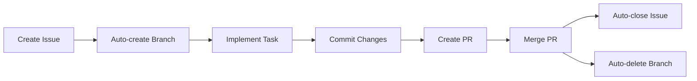

# TODO Management System - GitHub Issues Workflow

This skill provides a complete task management system using **GitHub Issues** as the primary workflow with automatic branch creation, PR management, and merging. TODO files are used **ONLY** for analysis, documentation, and summaries when explicitly requested by the user.

## Primary Workflow: GitHub Issues

### Why GitHub Issues?

- **Single source of truth** for all tasks
- Automatic branch creation and management
- Built-in progress tracking with labels and milestones
- Seamless PR workflow with issue linking
- Automatic issue closure on PR merge
- Complete history and audit trail
- Team collaboration features

### Workflow Overview



## Step 1: Create Issue from Task

### Command

```bash
# Create issue and checkout branch automatically
gh issue create \
  --title "feat(phase-X): task name" \
  --body "Task description..." \
  --assignee @me \
  --label "phase-X" \
  --checkout
```

### What This Does

1. Creates a new GitHub issue with the specified title and body
2. Assigns the issue to you (`@me`)
3. Adds a label (e.g., `phase-1`, `phase-2`)
4. **Automatically creates** a new branch named like `feature/task-name`
5. **Automatically checks out** the new branch

### Branch Naming Convention

The `--checkout` flag creates branches following these patterns:

- **Features**: `feature/task-name`
- **Fixes**: `fix/bug-description`
- **Chores**: `chore/maintenance-task`
- **Documentation**: `docs/update-documentation`

### Example

```bash
# Create issue for authentication feature
gh issue create \
  --title "feat(phase-3): implement user authentication" \
  --body "Implement user registration, login, and password reset functionality with BetterAuth" \
  --assignee @me \
  --label "phase-3,authentication" \
  --checkout

# Output:
# Creating issue in A0-42-org/vialto
# Created issue #42: feat(phase-3): implement user authentication
# Switched to branch 'feature/implement-user-authentication'
```

### Issue Body Template

```markdown
## Task Description
Brief description of what needs to be done.

## Acceptance Criteria
- [ ] Criterion 1
- [ ] Criterion 2
- [ ] Criterion 3

## Technical Details
- Database changes required
- API endpoints to implement
- Components to create

## Testing
- [ ] Unit tests
- [ ] Integration tests
- [ ] Manual testing
```

## Step 2: Implement Task

### Work on the Feature Branch

```bash
# You are now on the feature branch
git branch  # Shows: feature/task-name

# Implement your changes
# ... code changes ...
```

### Commit Frequently

```bash
# Stage all changes
git add .

# Commit with conventional commit format
git commit -m 'feat(phase-3): implement user registration'

# Push to remote
git push origin feature/task-name
```

### Multiple Commits

For larger tasks, use multiple focused commits:

```bash
# Commit 1: Database schema
git add drizzle/schema.ts
git commit -m 'feat(phase-3): add user table to schema'
git push

# Commit 2: Service layer
git add src/lib/server/user-service.ts
git commit -m 'feat(phase-3): implement user service'
git push

# Commit 3: API routes
git add src/routes/api/auth/
git commit -m 'feat(phase-3): add authentication endpoints'
git push
```

## Step 3: Create Pull Request

### Command

```bash
# Create PR and link to issue
gh pr create \
  --title "feat(phase-3): implement user authentication" \
  --body "Closes #<issue-number>" \
  --base main
```

### What This Does

1. Creates a pull request from your feature branch to `main`
2. Links the PR to the original issue
3. The `Closes #<issue-number>` keyword ensures the issue closes automatically when PR merges

### Example

```bash
# Create PR for authentication feature
gh pr create \
  --title "feat(phase-3): implement user authentication" \
  --body "Closes #42" \
  --base main

# Output:
# Creating pull request for feature/implement-user-authentication into main in A0-42-org/vialto
# https://github.com/A0-42-org/vialto/pull/15
```

### PR Body Template

```markdown
## Description
This PR implements user authentication with BetterAuth, including:
- User registration
- Login functionality
- Password reset

## Changes
- Add user table to database schema
- Implement authentication service
- Create API endpoints
- Add form components

## Testing
- [ ] All tests passing
- [ ] Manual testing completed

## Checklist
- [ ] Code follows project style guidelines
- [ ] Self-review completed
- [ ] Added necessary tests
- [ ] Documentation updated

Closes #42
```

## Step 4: Merge Pull Request

### Command

```bash
# Merge PR automatically with branch deletion
gh pr merge --merge --delete-branch
```
### What This Does

1. Merges the PR using a **merge commit** (preserves history)
2. **Automatically closes** the linked issue (#42)
3. **Deletes the feature branch** from both local and remote

### Merge Strategies

| Strategy | Flag | Description | Use When |
|----------|------|-------------|----------|
| Merge commit | `--merge` | Creates merge commit | Most common, preserves history |
| Squash | `--squash` | Squashes all commits | Clean history preferred |
| Rebase | `--rebase` | Rebases onto target | Linear history required |

### Example

```bash
# Merge the PR
gh pr merge --merge --delete-branch

# Output:
# Merge pull request #15 (feature/implement-user-authentication) into main
# ✓ Pull request merged
# ✓ Branch deleted: feature/implement-user-authentication
# ✓ Issue closed: #42
```

## Complete Workflow Example

### Full End-to-End Example

```bash
# === STEP 1: Create Issue ===
gh issue create \
  --title "feat(phase-2): create landing page hero section" \
  --body "Implement responsive hero section with CTA button and testimonial carousel" \
  --assignee @me \
  --label "phase-2,landing-page" \
  --checkout

# Output: Created issue #47, checked out branch 'feature/create-landing-page-hero-section'

# === STEP 2: Implement Task ===
# ... create src/routes/(landing)/hero.svelte ...
# ... create src/lib/data/landing.ts ...

git add .
git commit -m 'feat(phase-2): add hero component and data'
git push origin feature/create-landing-page-hero-section

# === STEP 3: Create PR ===
gh pr create \
  --title "feat(phase-2): create landing page hero section" \
  --body "Closes #47" \
  --base main

# Output: https://github.com/A0-42-org/vialto/pull/23

# === STEP 4: Merge PR ===
gh pr merge --merge --delete-branch

# Output:
# ✓ Pull request merged
# ✓ Branch deleted: feature/create-landing-page-hero-section
# ✓ Issue closed: #47

# === BACK ON MAIN ===
git pull origin main
```

## GitHub Labels Organization

### Phase Labels

```bash
# Use phase labels to organize work
--label "phase-0"      # Initialisation & Configuration
--label "phase-1"      # Database Schema
--label "phase-2"      # Landing Page
--label "phase-3"      # Backend Core
--label "phase-4"      # User Dashboard
--label "phase-5"      # Admin Dashboard
```

### Type Labels

```bash
--label "feat"        # New feature
--label "fix"         # Bug fix
--label "chore"       # Maintenance
--label "docs"        # Documentation
--label "refactor"    # Refactoring
--label "test"        # Tests
```

### Priority Labels

```bash
--label "priority:critical"
--label "priority:high"
--label "priority:medium"
--label "priority:low"
```

### Status Labels

```bash
--label "status:in-progress"
--label "status:review-needed"
--label "status:blocked"
--label "status:ready"
```

## Issue Management Commands

### List Issues

```bash
# List all open issues
gh issue list

# List by label
gh issue list --label "phase-3"

# List assigned to you
gh issue list --assignee @me

# Show issue details
gh issue view 42
```

### View Pull Requests

```bash
# List all open PRs
gh pr list

# View PR details
gh pr view 15

# Check PR status
gh pr status
```

### Branch Management

```bash
# List all branches
gh repo view --json defaultBranchRef,name

# Switch to main after merge
git checkout main
git pull origin main

# Clean up local branches
git branch -d feature/task-name  # Safe delete (merged)
git branch -D feature/task-name  # Force delete
```

## When to Use TODO Files

### Primary Rule

**TODO files are NOT for daily task management.** Use GitHub Issues for all active development tasks.

### When to Create TODO Files

Use TODO files ONLY when:

1. **User explicitly requests** a TODO analysis
2. Creating **project summary reports** for stakeholders
3. **Documenting project structure** and architecture
4. **Planning future phases** before implementation
5. **Creating client reports** or documentation

### TODO File Location

```
project/
├── docs/
│   ├── TODO_IMPROVED.md    # Analysis/summary only (NOT for active tasks)
│   ├── PRD.md             # Product requirements
│   └── CLIENT_REPORT.md   # Client reports
```

### TODO File Purpose

- **High-level planning** and roadmapping
- **Stakeholder communication** and reporting
- **Historical documentation** of completed work
- **Architecture summaries** and technical decisions
- **Phase documentation** for reference

## Progress Tracking (Optional - for Documentation Only)

### GitHub Issues as Progress Tracker

GitHub Issues **ARE** the progress tracker. Use them directly:

```bash
# View all issues for a phase
gh issue list --label "phase-3"

# See closed/completed issues
gh issue list --label "phase-3" --state closed

# Check completion rate
gh issue list --json number,state,title | jq '. | length'
```

### Summary Table for Documentation

When creating documentation or reports, you can summarize progress:

```markdown
## 📊 Progression globale - Phase 3

### GitHub Issues Summary
| Issue | Title | Status | Assignee |
|-------|-------|--------|----------|
| #42 | User authentication | ✅ Closed | @user |
| #45 | Referral service | 🟡 In Progress | @user |
| #48 | Gift management | 🔜 Open | - |

**Progression : 1/3 issues completed (33%)**
```

## Phase-based Structure (for Documentation)

### Organize Work by Phases

When creating planning documents or summaries:

```markdown
## 🚀 Phase 3: Backend Core Features

### Issues Created
- [x] #42 - User authentication
- [x] #43 - Database schema
- [ ] #45 - Referral service
- [ ] #47 - Gift management
```

### Phase Documentation

Use phases to organize **GitHub Issue labels** and **planning documents**:

- Phase 0: Initialisation & Configuration
- Phase 1: Database Schema
- Phase 2: Landing Page
- Phase 3: Backend Core
- Phase 4: User Dashboard
- Phase 5: Admin Dashboard

## Bilingual Support

### Issue Titles and Bodies

```markdown
## Task Description / Description de la tâche
Implement user registration / Implémenter l'inscription utilisateur

## Criteria / Critères d'acceptation
- [ ] Registration form / Formulaire d'inscription
- [ ] Email validation / Validation par email
- [ ] Error handling / Gestion des erreurs
```

### Language Guidelines

- Use **English** for code-related terms
- Use **French** for UI-related terms (if project is French)
- Maintain consistency in language
- Translate technical terms appropriately

## Best Practices

### Issue Creation

1. **One task per issue** - Keep issues focused
2. **Clear titles** - Use conventional commit format
3. **Detailed descriptions** - Include acceptance criteria
4. **Proper labels** - Use phase and type labels
5. **Assign immediately** - Always assign to someone

### Commit Guidelines

```bash
# Use conventional commit format
feat(phase-X): description
fix(phase-X): description
docs(phase-X): description
refactor(phase-X): description
test(phase-X): description
```

### Pull Request Best Practices

1. **Link to issues** - Always use `Closes #<number>`
2. **Descriptive titles** - Match issue title
3. **Detailed bodies** - Explain changes clearly
4. **Review before merge** - Self-review your PRs
5. **Delete branches** - Always use `--delete-branch`

### Workflow Discipline

- **Always create an issue** before starting work
- **Always use `--checkout`** for automatic branch management
- **Always link PR to issue** with `Closes #<number>`
- **Always merge with `--delete-branch`** to clean up
- **Always pull main** after merge to stay updated

## Quick Reference

### Complete Workflow

```bash
# 1. Create issue + branch
gh issue create --title "feat(phase-X): task" --body "Description" --assignee @me --label "phase-X" --checkout

# 2. Implement + commit
git add . && git commit -m 'feat(phase-X): description' && git push

# 3. Create PR
gh pr create --title "feat(phase-X): task" --body "Closes #<issue>" --base main

# 4. Merge + cleanup
gh pr merge --merge --delete-branch
git checkout main && git pull
```

### Issue Management

```bash
gh issue list                    # List issues
gh issue view <number>            # View issue
gh pr list                        # List PRs
gh pr view <number>               # View PR
gh pr status                      # PR status
```

### Branch Commands

```bash
git branch                        # Show current branch
git checkout main                 # Switch to main
git pull origin main              # Update main
git branch -d <branch>            # Delete merged branch
```

---

**Use GitHub Issues as your primary task management system. TODO files are for analysis and documentation only.**
